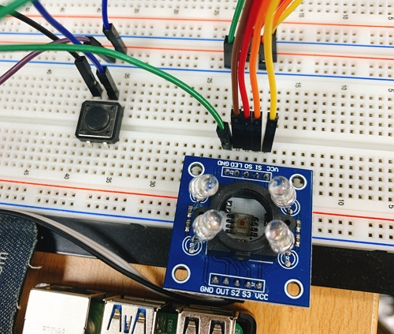
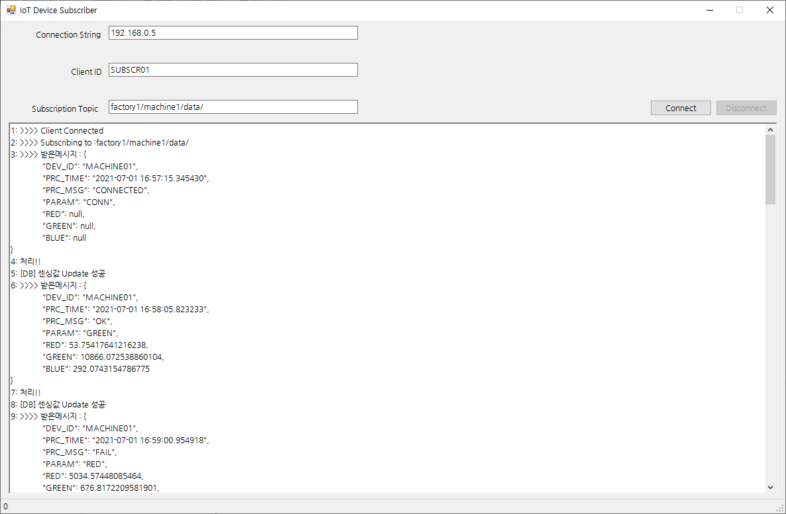
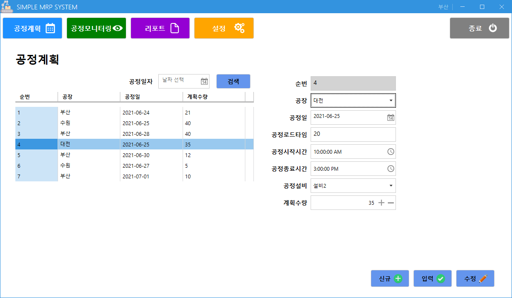
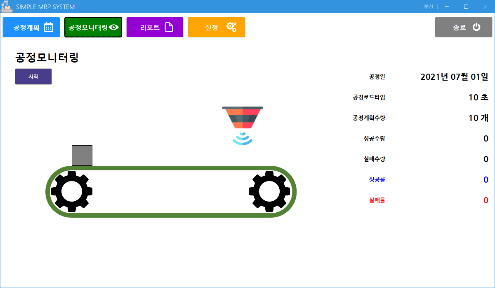
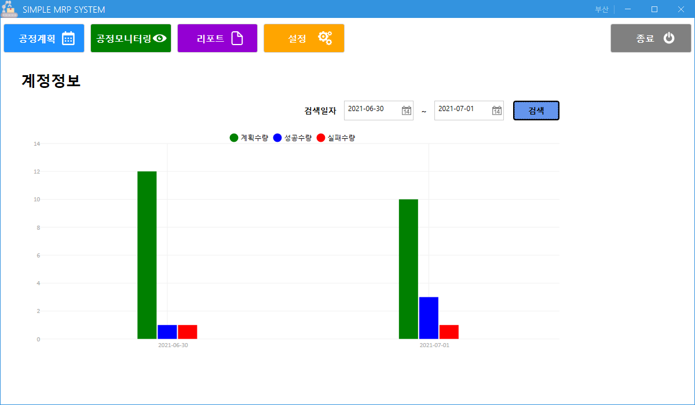
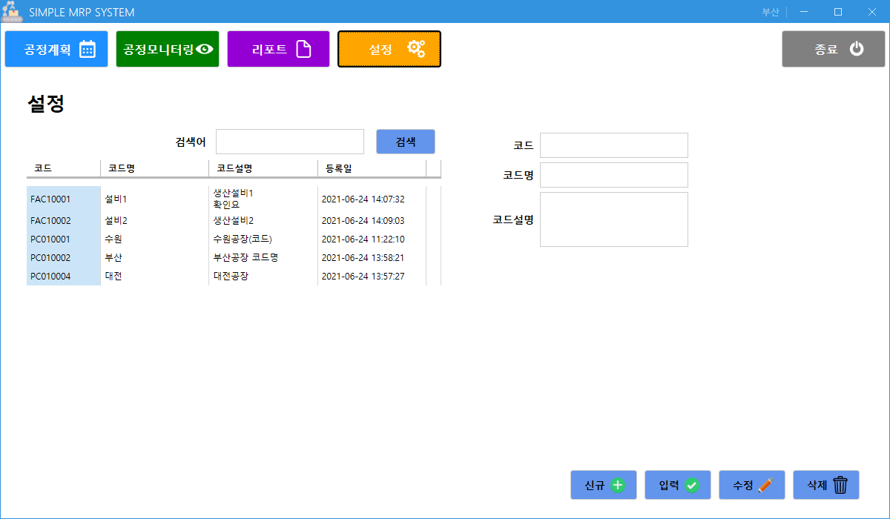

# MiniProject_SimpleMRP
SmartFactory 공정관리 with RaspberryPi
- [공정 과정](#공정-과정)
- [Device Subscriber](#device-subscriber)
- [공정 모니터링](#공정-모니터링)

## 공정 과정 
 
</img>

- color sensor을 이용해서 색깔별로 분류
- red : FAIL
- green : OK
- blud : ERR
- MQTT Publish
- json형식으로 센싱 결과 전송

[MQTT Publish](MRPApp/rasberrypi/mqtt_publish_app.py)

## Device Subscriber
 
</img>

- json형식의 메시지를 수신
- connection string, client id, topic을 설정하여 MQTT 연결
- 연결, 연결 해제 기능 버튼

[Device Subscribe](MRPApp/DeviceSubApp)

## 공정 모니터링 
1. 공정 계획 
</img>

- 공정일자에 따른 공장, 로드타임, 공정시간, 공정설비, 계획수량을 입력, 수정하고 DB에 저장

[ScheduleView](MRPApp/MRPApp/View/Schedule/)
 
2. 공정 모니터링 
</img> 
</img>

- 오늘날짜를 공정일로 설정 하여 정보를 받아와서 화면에 표시
- 센싱결과를 읽어와서 공정 결과를 표시하고 데이터를 DB에 저장
- 애니메이션을 이용해 공정과정을 보여주고 실제 공정 결과에 따라 물체의 색상이 변경

[ProcessView](MRPApp/MRPApp/View/Process/)

3. 리포트 
</img>

- 선택한 공정일의 계획수량, 성공수량, 실패수량을 그래프로 표현
- 검색일자를 기간으로도 설정 가능

[ReportView](MRPApp/MRPApp/View/Report/)

4. 설정 
</img>

- 설비, 공장에 대한 정보를 코드, 코드명, 코드설명으로 입력, 수정하고 DB에 저장

[SettingView](MRPApp/MRPApp/View/Setting/)
