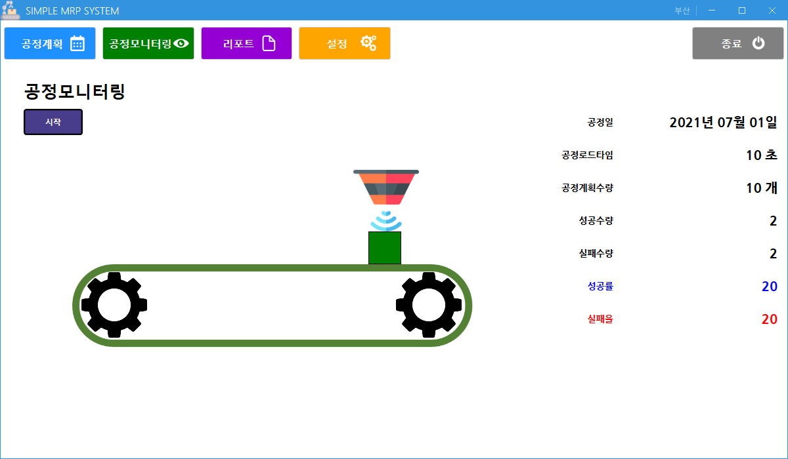

# MiniProject_SimpleMRP
SmartFactory 공정관리 with RaspberryPi

## 공정 과정 
 
</img> 
- color sensor을 이용해서 색깔별로 분류
- red : FAIL
- green : OK
- blud : ERR
- MQTT Publish
- json형식으로 센싱 결과 전송

[sensor](MRPApp/rasberrypi/mqtt_publish_app.py)

## Device Subscriber
 
</img> 

- json형식으로 전송된 메시지를 수신
- connection string, client id, topic을 설정하여 MQTT 연결
- 받아온 값을 데이터베이스에 저장
- 연결, 연결 해제 기능 버튼

[Device Subscriber](MRPApp/DeviceSubApp)

## 공정 모니터링 
1. 공정 스케줄 
 
</img> 
 
2. 공정 모니터링 
 
</img> 
</img> 

3. 리포트 
 
</img> 

4. 설정 
 
</img> 

